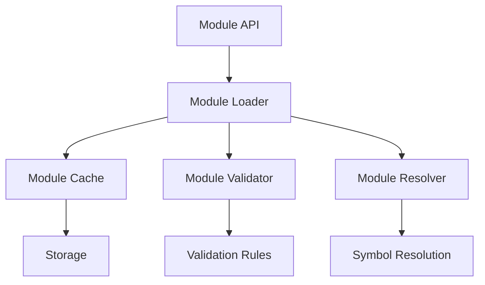

# Architecture

The Stremax module system is built with a layered architecture that promotes separation of concerns and maintainability.

## System Overview



## Core Components

### 1. Module Representation

The `Module` struct is the central data structure:

```rust
pub struct Module {
    id: ModuleId,
    path: PathBuf,
    source: Option<String>,
    exports: HashMap<Symbol, Export>,
    imports: Vec<Import>,
    dependencies: Vec<ModuleId>,
    visibility: HashMap<Symbol, Visibility>,
    cache: ModuleCache,
}
```

### 2. Concurrent Module Loader

The loader handles module loading and dependency resolution:

```rust
pub struct ConcurrentModuleLoader {
    modules: RwLock<HashMap<ModuleId, Arc<RwLock<Module>>>>,
    search_paths: RwLock<Vec<PathBuf>>,
    cache: RwLock<ModuleCache>,
    validator: Box<dyn ModuleValidator>,
    max_concurrent_loads: Semaphore,
}
```

### 3. Module Cache

The caching system provides efficient symbol lookup:

```rust
pub struct OptimizedModuleCache {
    symbols: RwLock<LruCache<Symbol, Arc<SymbolData>>>,
    types: RwLock<LruCache<Symbol, Arc<TypeData>>>,
    functions: RwLock<LruCache<Symbol, Arc<FunctionData>>>,
    constants: RwLock<LruCache<Symbol, Arc<ConstantData>>>,
    stats: RwLock<CacheStats>,
}
```

### 4. Hot Reload System

The hot reload manager handles file system events:

```rust
pub struct HotReloadManager {
    loader: Arc<ConcurrentModuleLoader>,
    watcher: notify::RecommendedWatcher,
    file_times: RwLock<HashMap<PathBuf, SystemTime>>,
    tx: broadcast::Sender<ModuleChangeEvent>,
    watched_paths: RwLock<HashMap<PathBuf, ModuleId>>,
}
```

## Data Flow

1. **Module Loading**:
   ```mermaid
   sequenceDiagram
       participant Client
       participant Loader
       participant Cache
       participant Validator
       
       Client->>Loader: load_module(id)
       Loader->>Cache: check_cache(id)
       Cache-->>Loader: cache_miss
       Loader->>Loader: parse_module()
       Loader->>Validator: validate()
       Validator-->>Loader: ok
       Loader->>Cache: cache_module()
       Loader-->>Client: module
   ```

2. **Symbol Resolution**:
   ```mermaid
   sequenceDiagram
       participant Client
       participant Resolver
       participant Module
       participant Cache
       
       Client->>Resolver: resolve_symbol(name)
       Resolver->>Module: get_export(name)
       Module->>Cache: get_symbol(name)
       Cache-->>Module: symbol_data
       Module-->>Resolver: result
       Resolver-->>Client: resolved_symbol
   ```

## Concurrency Model

The system uses a combination of synchronization primitives:

1. **Read-Write Locks** (`RwLock`):
   - Module cache access
   - Module state management
   - Search path modifications

2. **Semaphores**:
   - Limiting concurrent module loads
   - Resource management

3. **Arc** (Atomic Reference Counting):
   - Shared ownership of modules
   - Thread-safe data sharing

## Error Handling

The error system uses a hierarchical approach:

```rust
pub enum ModuleError {
    NotFound(ModuleId),
    ParseError { module: ModuleId, message: String },
    CircularDependency { path: Vec<ModuleId> },
    InvalidSymbol { module: ModuleId, symbol: Symbol },
    VisibilityViolation { module: ModuleId, symbol: Symbol },
    // ...
}
```

## Extension Points

The system provides several extension points:

1. **Module Hooks**:
   ```rust
   pub trait ModuleHook: Send + Sync {
       fn on_load(&self, module: &mut Module) -> Result<()>;
       fn on_unload(&self, module: &Module) -> Result<()>;
       fn on_resolve(&self, name: &Symbol, module: &Module) -> Option<Arc<SymbolData>>;
   }
   ```

2. **Custom Validators**:
   ```rust
   pub trait ModuleValidator: Send + Sync {
       fn validate(&self, module: &Module) -> Result<()>;
   }
   ```

## Performance Considerations

1. **Caching Strategy**:
   - LRU cache for symbols
   - Size-based eviction
   - Performance metrics tracking

2. **Concurrent Loading**:
   - Parallel dependency resolution
   - Bounded concurrency
   - Lock-free operations where possible

3. **Memory Management**:
   - Reference counting for shared data
   - Explicit cache size limits
   - Automatic resource cleanup 